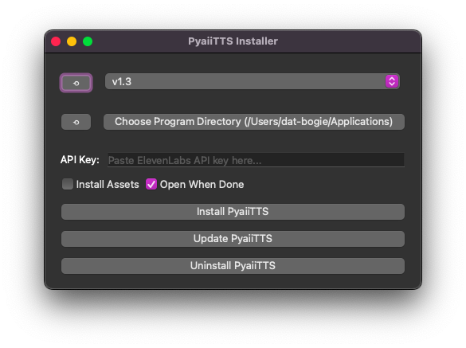

# PyaiiTTS-Installer 
A small app designed to install/manage [PyaiiTTS](https://github.com/DatBogie/PyaiiTTS).
- Easily install, update, and uninstall all* versions of PyaiiTTS.
- Crossplatform between Linux, Windows, and macOS*.
- Automatically installs all needed assets.
- Automatically inputs the given Elevenlabs key; no more instant crashes on old versions!

 *Some versions are not available on macOS.
 &nbsp;
### Screenshots:
_(Hover an image for a caption.)_

